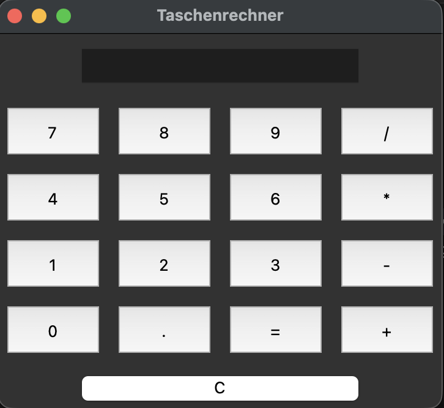

# 🧮 Taschenrechner App (Python)

Ein einfacher grafischer Taschenrechner, erstellt mit Python.

## 🧰 Technologien
- Python 3.14
- Tkinter (GUI-Framework)
- VS Code

## 🚀 Funktionen
- Grundrechenarten (Addition, Subtraktion, Multiplikation, Division)
- GUI mit Buttons und Eingabefeld
- Fehlerbehandlung bei falscher Eingabe

## 📸 Screenshot


## ▶️ Ausführen
1. Repository klonen oder herunterladen  
2. Python installieren (>=3.14)  
3. In den Projektordner wechseln  
4. Ausführen mit:
   ```bash
   python calculator_gui.py
