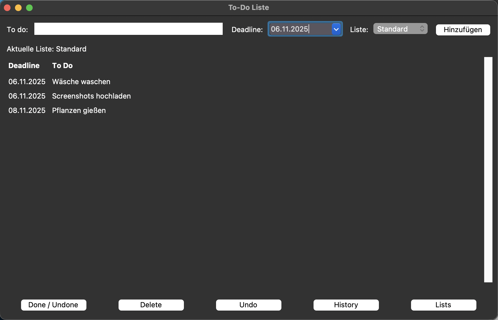
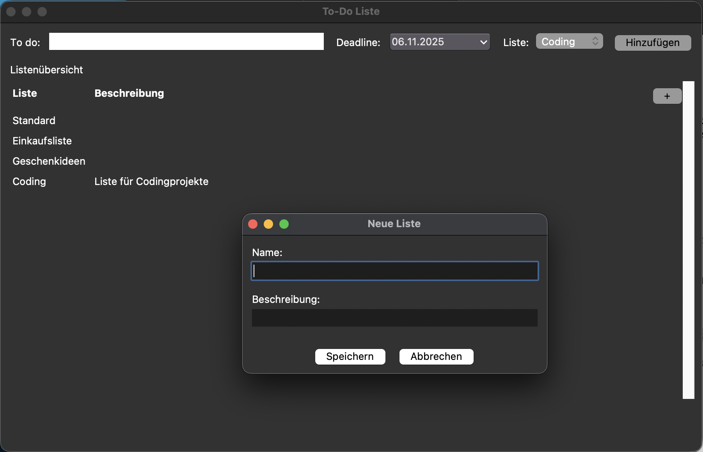
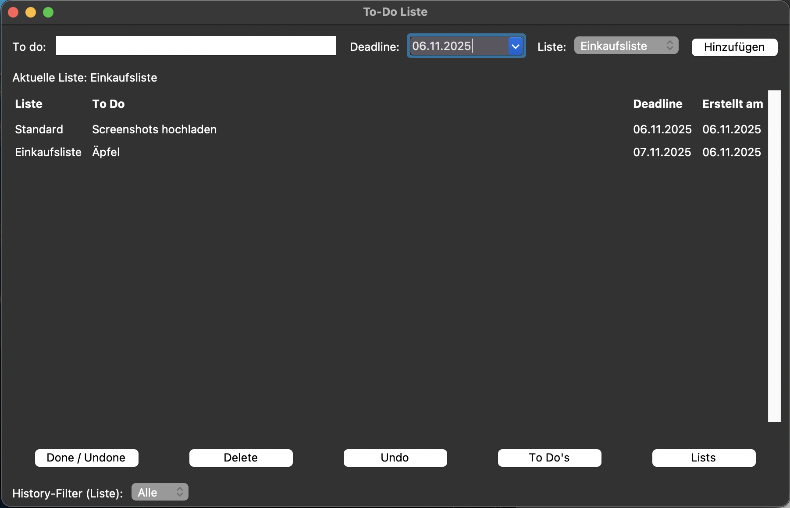

# ✅ To-Do Listen App (Python)

Eine einfache, aber ziemlich mächtige To-Do App mit mehreren Listen, Deadlines, History & Undo – erstellt mit Python.

## 🧰 Technologien
- Python 3.14
- Tkinter (GUI-Framework)
- tkcalendar (für Datumsauswahl)
- VS Code
- (optional) PyInstaller für Desktop-App (.app / .exe)

## 🚀 Funktionen

### 📝 To-Dos
- To-Dos mit Titel und Deadline erstellen  
- Deadline immer im Format `TT.MM.JJJJ`  
- Datum bequem über Kalender-Popup (`tkcalendar.DateEntry`) auswählen  
- Offene To-Dos werden **nach Fälligkeit (aufsteigend)** sortiert angezeigt  
- Langer Text wird in der Ansicht automatisch umgebrochen

### 📂 Listenverwaltung
- Beliebig viele Listen (z.B. „Arbeit“, „Privat“, „Einkaufen“)  
- Listenübersicht mit:
  - Spalte **Liste**
  - Spalte **Beschreibung**
- Neue Liste über `+`-Button erstellen  
- Listen per Rechtsklick-Kontextmenü:
  - **Bearbeiten**
  - **Löschen** (inkl. aller zugehörigen To-Dos)
- Klick auf eine Liste öffnet die zur Liste gehörenden To-Dos  
- Aktive Liste wird oberhalb der Tabelle angezeigt (`Aktuelle Liste: ...`)

### ⏱ Deadlines & History
- Offene To-Dos:  
  - Ansicht zeigt `Deadline | To Do`  
  - Sortiert nach Deadline (früheste zuerst)
- History-Ansicht:
  - Zeigt **erledigte** To-Dos
  - Spalten: `Liste | To Do | Deadline | Erstellt am`
  - Ebenfalls nach Deadline sortiert
  - Filter für eine bestimmte Liste oder **Alle** über Dropdown

### 🔁 Aktionen & Undo
- `Done / Undone` – To-Dos als erledigt markieren oder wieder zurücksetzen  
- `Delete` – To-Do löschen  
- `Undo` – bis zu **10 Schritte** rückgängig machen (für alle Listen übergreifend)  
- `History` – Ansicht zwischen offenen To-Dos und History umschalten  
- `Lists` – zur Listenübersicht wechseln

### 💾 Datenspeicherung
- Alle Daten (Listen + To-Dos) werden in einer JSON-Datei gespeichert:
  - `todo_data.json`
- Speicherort: **im gleichen Ordner wie das Script bzw. die App**
  - z.B. `/Users/…/todoliste/todo_data.json`
- Beim Schließen der App wird automatisch gespeichert  
- Beim Start werden die Daten automatisch wieder geladen

## 📸 Screenshot




## ▶️ Ausführen (Entwicklung)
1. Repository klonen oder herunterladen  
2. Python installieren (>= 3.14)  
3. Abhängigkeiten installieren:
   ```bash
   pip install tkcalendar
4. In den Projektordner wechseln
5. App starten: python todoliste.py  

## 💻 Als Desktop-App bauen (optional mit PyInstaller)
1. PyInstaller installieren: pip install pyinstaller  
2. In den Projektordner wechseln
3. Build erstellen: pyinstaller --onefile --windowed todoliste.py  
4. Die fertige App liegt im Ordner dist/  
   - macOS: todoliste bzw. todoliste.app  
   - Windows: todoliste.exe  

Hinweis: Die Datei todo_data.json wird im gleichen Ordner gespeichert, in dem das Programm ausgeführt wird.  
Wenn du die App z. B. auf den Desktop verschiebst, wird dort auch die JSON-Datei angelegt.


## ✅ Voraussetzungen
- Python 3.14 oder höher  
- tkinter (oft bereits vorinstalliert)  
- tkcalendar (per pip install tkcalendar)

---

Viel Spaß beim Organisieren deiner To-Dos 🧠✨


